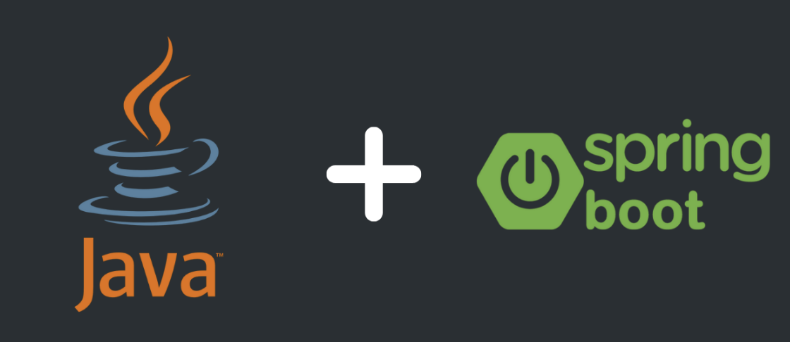

# Floor Plan Management System

## Overview

This floor plan management system is designed to offer a robust solution for efficiently managing floor plans, encompassing meeting rooms along with their respective capacities. The system incorporates advanced features, including:

- **Admin Panel** : A sophisticated admin panel is implemented for seamless modification of floor plans, ensuring administrative control.
- **Conflict Resolution System** : The application boasts a conflict resolution system that intelligently considers timestamps and user roles, assigning the highest priority to the admin role for conflict resolution.
- **Version Control** : To track changes systematically, a version control mechanism is integrated. Each updated floor plan receives a unique version number, and the entire version history is managed on the server.

## Tech Stack Used

For the backend, the system leverages a powerful tech stack to ensure optimal performance and scalability. Key components include:

- **Java and Spring Boot**: Employed for backend development, providing a robust and scalable foundation.
- **H2 Database**: Act as a SQL database wrapper using Spring Boot, facilitating efficient storage.



On the frontend, a seamless communication process is facilitated through:

- **Python Wrapper**: Developed to communicate with the backend, enabling users to modify, retrieve, and display floor plans with ease.

## Various features

### Authentication

- **Static Authentication Setup**: The system employs a robust static authentication mechanism to control access to floor plan modifications. Specifically, only admin users are granted the authority to make changes, enhancing security and safeguarding the integrity of the floor plans.


                                          Ensuring only admin can update the table

### Cost Estimation

- **Space Complexity**: The GET operation involves reading from the database without additional space consumption. In contrast, the post operation for updating the floor plan utilizes a fixed amount of space based on the number of floors and rooms per floor.
- **Time Complexity**: The search operation for GET can take up to the number of existing versions, while the put operation, involving adding a column to the database, is executed in constant time.

### **Handling System Failure Cases**

- **Fault Tolerance**: Both backend and frontend are designed with high fault tolerance. Strict type checking in the UI and backend minimizes the risk of undesired input causing issues.


                  The table defined using Entity which defines the datatypes of all columns being stored

- **Database Consistency**: In the event of a system failure, the database remains constant. During system startup, the database can be seamlessly utilized, minimizing downtime to the system's rebooting time.

### **Object-Oriented Programming Language (OOPS)**

- **Abstraction and Encapsulation**: Robust OOPS principles are followed, with extensive abstraction in the backend. Multiple models are created to abstract and encapsulate data storage, enhancing system organization.


                                                   Project structure of the backend

- **Polymorphism**: Implemented to ensure flexibility and adaptability within the codebase.
- **Modularization**: The code is highly modularized, enabling easy addition of new functionality. Each feature is organized into its own class, simplifying debugging and maintenance.

### **Trade-offs in the System**

Since this was created in just less than a day there are bound to be some trade offs. 

- **UI Choice**: A CLI-style UI was chosen over a full-fledged browser UI due to the simplicity of operations.
- **Database Selection**: Opting for a simpler database solution (H2) over more advanced options like MySQL or AWS DynamoDB, considering the infrequent changes in floor plans.

### **Error and Exception Handling**

- **Try-Catch Blocks**: Implemented at critical operations to handle potential issues.


                         Handling parsing exceptions while serialisation and deserialisation

- **Comprehensive Error Handling**: Covers parsing and various aspects to ensure robust application performance.


                                              Handling backend responses in CLI

## ****Backend Installation****

### **Prerequisites**

- Java Development Kit (JDK) 11 or higher
- Maven

### **Steps**

1. **Clone the repository:**

```bash
git clone [https://github.com/yourusername/floor-plan-management-system.git](https://github.com/yourusername/floor-plan-management-system.git)
cd floor-plan-management-system
```

1. **Build and Run the Backend:**

```bash
cd backend
mvn clean install
mvn spring-boot:run
```

The backend will run on **`http://localhost:8080`**.


## ****Frontend Installation****

### **Prerequisites**

- Python 3.x

### **Steps**

1. **Install required Python packages:**

```bash
pip install requests tabulate colorama
```

1. **Run the CLI Frontend:**

```bash
cd frontend
python floor_plan_ui.py
```

Follow the prompts to interact with the Floor Plan Management System.


